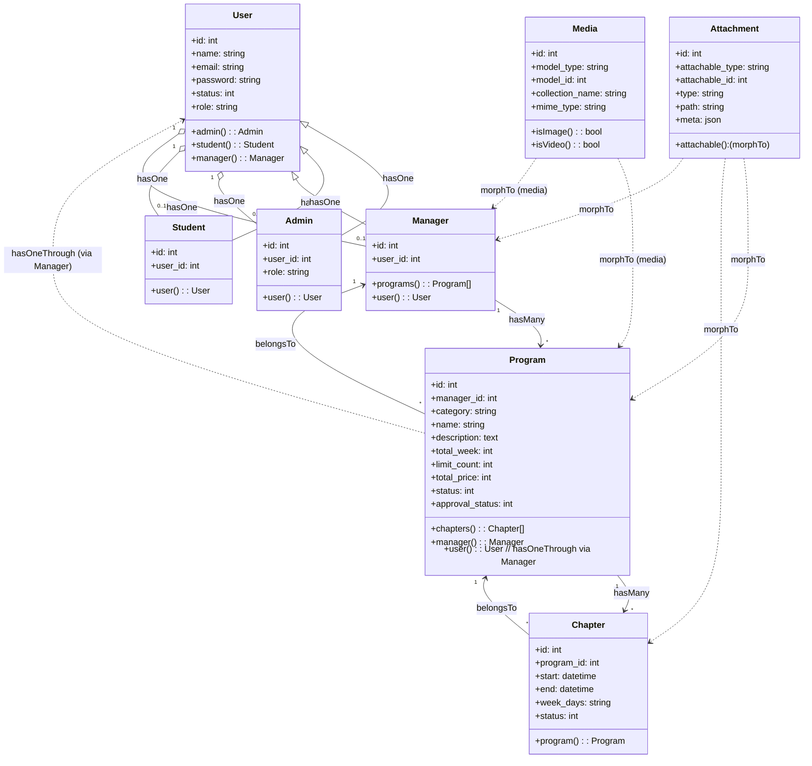

# miniLms Class Diagram (Mermaid)

```mermaid
%%{init: {
  "themeVariables": { "fontSize": "18px" },
  "classDiagram": { "useMaxWidth": false, "nodeSpacing": 60, "rankSpacing": 80 }
}}%%
classDiagram
    direction TB

    class User {
      +id: int
      +name: string
      +email: string
      +password: string
      +status: int
      +role: string
      +admin(): Admin
      +student(): Student
      +manager(): Manager
    }

    class Admin {
      +id: int
      +user_id: int
      +role: string
      +user(): User
    }

    class Student {
      +id: int
      +user_id: int
      +user(): User
    }

    class Manager {
      +id: int
      +user_id: int
      +programs(): Program[]
      +user(): User
    }

    class Program {
      +id: int
      +manager_id: int
      +category: string
      +name: string
      +description: text
      +total_week: int
      +limit_count: int
      +total_price: int
      +status: int
      +approval_status: int
      +chapters(): Chapter[]
      +manager(): Manager
      +user(): User // hasOneThrough via Manager
    }

    class Chapter {
      +id: int
      +program_id: int
      +start: datetime
      +end: datetime
      +week_days: string
      +status: int
      +program(): Program
    }

    %% Relationships
    User <|-- Admin : hasOne
    User <|-- Student : hasOne
    User <|-- Manager : hasOne

    User "1" o-- "0..1" Admin : hasOne
    User "1" o-- "0..1" Student : hasOne
    User "1" o-- "0..1" Manager : hasOne

    Manager "1" --> "*" Program : hasMany
    Program "*" --> "1" Manager : belongsTo

    Program "1" --> "*" Chapter : hasMany
    Chapter "*" --> "1" Program : belongsTo

    %% Through relation (Program -> User via Manager)
    Program ..> User : hasOneThrough (via Manager)

    %% Polymorphic attachments (custom Attachment model)
    class Attachment {
      +id: int
      +attachable_type: string
      +attachable_id: int
      +type: string
      +path: string
      +meta: json
      +attachable(): (morphTo)
    }
    Attachment ..> Program : morphTo
    Attachment ..> Chapter : morphTo
    Attachment ..> Manager : morphTo

    %% Spatie MediaLibrary integration
    class Media {
      +id: int
      +model_type: string
      +model_id: int
      +collection_name: string
      +mime_type: string
      +isImage(): bool
      +isVideo(): bool
    }
    Media ..> Program : morphTo (media)
    Media ..> Manager : morphTo (media)
```